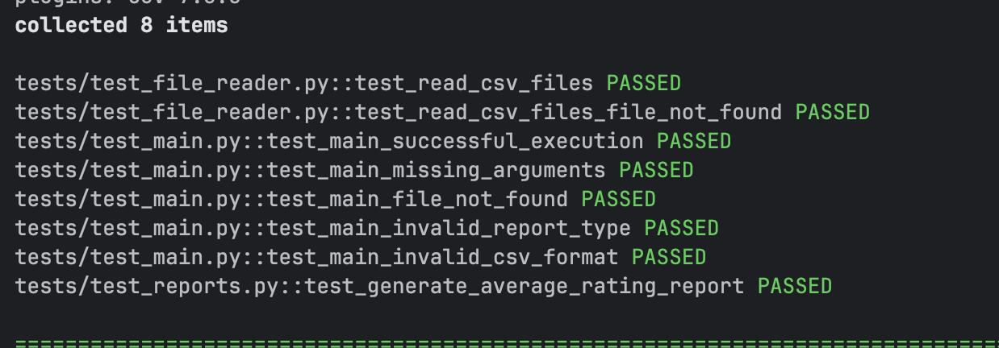

# Анализ рейтинга брендов

Скрипт для анализа CSV файлов с данными о продуктах и генерации отчетов.

## Установка

```bash
pip install -r requirements.txt
```

## Запуск

```bash
python -m src.main --files products1.csv products2.csv --report average-rating
```

## Тестирование

```bash
pytest tests/ -v
```




## Добавление новых отчетов

Для добавления нового отчета нужно:
1. Создать новую функцию в reports/
2. Добавить обработку нового аргумента в main.py
3. Для дополнительной валидации данных добавить новый датакласс в models.py (Опционально)